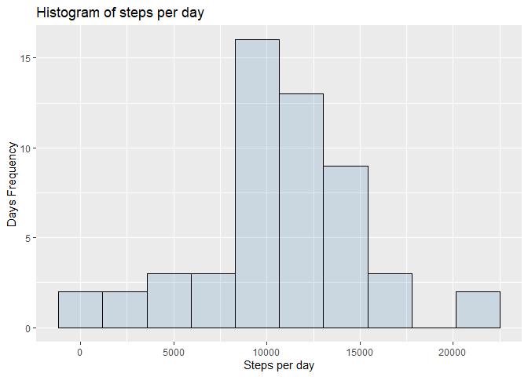
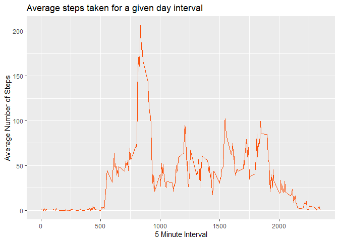
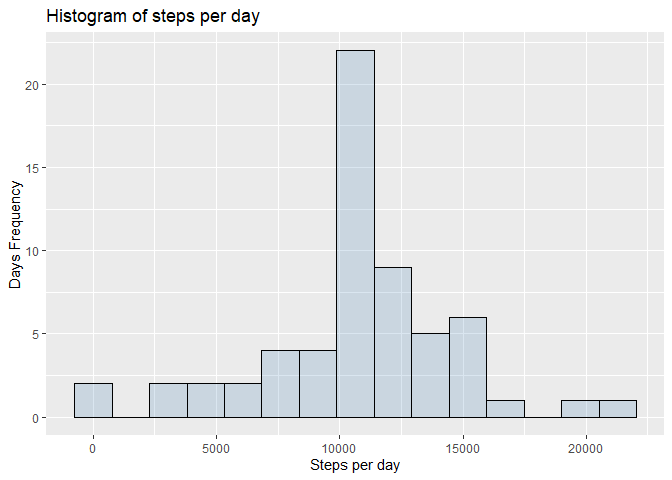
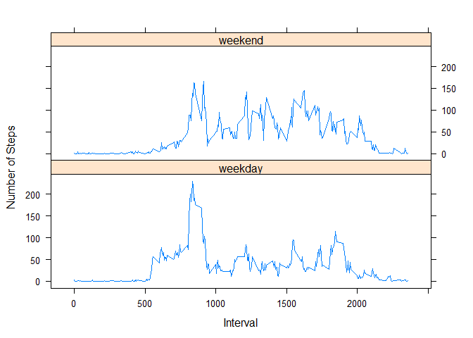

First, we load necessery packages by using the function library

```r
library(ggplot2)
library(dplyr)
library(ggthemes)
```

# Loading and preprocessing the data

## Load the activity data:
The variables included in this dataset are:

steps: Number of steps taking in a 5-minute interval (missing values are coded as NA)  
date: The date on which the measurement was taken in YYYY-MM-DD format  
interval: Identifier for the 5-minute interval in which measurement was taken  


```r
# Load the data
activity <- read.csv("activity.csv")
```


## Process/transform the data (if necessary) into a format suitable for your analysis:

Transform the data ftame to tibble

```r
activity$date <- as.Date(activity$date)
```


```r
activity <- tbl_df(activity)
```


# What is mean total number of steps taken per day?

## Calculate the total number of steps taken per day

```r
activity_day <- aggregate(steps~date,activity,sum, na.rm = TRUE)
head(activity_day,5)
```

```
##         date steps
## 1 2012-10-02   126
## 2 2012-10-03 11352
## 3 2012-10-04 12116
## 4 2012-10-05 13294
## 5 2012-10-06 15420
```

## Make a histogram of the total number of steps taken each day


First compute the width of the bins to be used in the histogram by using [Freedman-Diaconis rule](https://en.wikipedia.org/wiki/Freedman%E2%80%93Diaconis_rule)


```r
bw <- 2 * IQR(activity_day$steps) / length(activity_day$steps)^(1/3)
```


Plot the Histogram

```r
ggplot(activity_day, aes(steps)) +
  geom_histogram(binwidth = bw,color="black", fill = "steelblue", alpha = 0.2) +
  labs(title="Histogram of steps per day", x="Steps per day", y="Days Frequency") 
```

<!-- -->


## Calculate and report the mean and median of the total number of steps taken per day


```r
mean_steps <- round(mean(activity_day$steps))
median_steps <- round(median(activity_day$steps))
```


The mean of the total number of steps taken per day: **10766**  
The median of the total number of steps taken per day:**10765**  

# What is the average daily activity pattern?

## Make a time series plot (i.e. \color{red}{\verb|type = "l"|}type="l") of the 5-minute interval (x-axis) and the average number of steps taken, averaged across all days (y-axis)


```r
avg_activity <- aggregate(steps~interval,data = activity,mean,na.rm = TRUE)
head(avg_activity,5)
```

```
##   interval     steps
## 1        0 1.7169811
## 2        5 0.3396226
## 3       10 0.1320755
## 4       15 0.1509434
## 5       20 0.0754717
```


```r
ggplot(avg_activity, aes(x = interval, y = steps)) + 
  geom_line(color = "#FC4E07") +
  labs(title="Average steps taken for a given day interval", x="5 Minute Interval", y="Average Number of Steps") 
```

<!-- -->


## Which 5-minute interval, on average across all the days in the dataset, contains the maximum number of steps?

```r
max_ave_steps <- round(max(avg_activity$steps))
interval <- avg_activity %>% 
    filter(steps == max_ave_steps) %>%
    select(interval)
```

The interval **206** , on average across all the days in the dataset, contains the maximum number of steps of **206**.


# Imputing missing values

## Calculate and report the total number of missing values in the dataset (i.e. the total number of rows with \color{red}{\verb|NA|}NAs)

NA Count of missing data:


```r
#Check the total NA in each colums
colSums(is.na(activity))
```

```
##    steps     date interval 
##     2304        0        0
```

## Devise a strategy for filling in all of the missing values in the dataset. The strategy does not need to be sophisticated. For example, you could use the mean/median for that day, or the mean for that 5-minute interval, etc.


The chosen strategy to treat NAs, is to fill the interval with NA with the average computed before.
For example on **2012-10-01**, interval 0,which is an NA, we put 	**1.7169811**. Which is the average steps observed on that interval accross days.


```r
interval2avg_steps <- function(interval) {
  avg_activity[avg_activity$interval==interval,]$steps
}
```


## Create a new dataset that is equal to the original dataset but with the missing data filled in.

```r
#Coppy a dataframe
activity_No_NA <- activity #Create a new dataset

for(i in 1:nrow(activity_No_NA)){
    if(is.na(activity_No_NA[i,]$steps)){
        activity_No_NA[i,]$steps<-interval2avg_steps(activity_No_NA[i,]$interval)
        
    }
}

head(activity_No_NA)
```

```
## # A tibble: 6 x 3
##    steps date       interval
##    <dbl> <date>        <int>
## 1 1.72   2012-10-01        0
## 2 0.340  2012-10-01        5
## 3 0.132  2012-10-01       10
## 4 0.151  2012-10-01       15
## 5 0.0755 2012-10-01       20
## 6 2.09   2012-10-01       25
```
## Make a histogram of the total number of steps taken each day and Calculate and report the mean and median total number of steps taken per day. Do these values differ from the estimates from the first part of the assignment? What is the impact of imputing missing data on the estimates of the total daily number of steps?

### Calculate the total number of steps taken per day

```r
activity_No_NA_day <- aggregate(steps~date,activity_No_NA,sum, na.rm = TRUE)
head(activity_No_NA_day, 5)
```

```
##         date    steps
## 1 2012-10-01 10766.19
## 2 2012-10-02   126.00
## 3 2012-10-03 11352.00
## 4 2012-10-04 12116.00
## 5 2012-10-05 13294.00
```

### Make a histogram of the total number of steps taken each day


First compute the width of the bins to be used in the histogram by using [Freedman-Diaconis rule](https://en.wikipedia.org/wiki/Freedman%E2%80%93Diaconis_rule)


```r
bw2 <- 2 * IQR(activity_No_NA_day$steps) / length(activity_No_NA_day$steps)^(1/3)
```


Plot the Histogram

```r
ggplot(activity_No_NA_day, aes(steps)) +
  geom_histogram(binwidth = bw2,color="black", fill = "steelblue", alpha = 0.2) +
  labs(title="Histogram of steps per day", x="Steps per day", y="Days Frequency") 
```

<!-- -->


```r
mean_No_NA_steps <- round(mean(activity_No_NA_day$steps))
median_No_NA_steps <- round(median(activity_No_NA_day$steps))
```


The mean of the total number of steps taken per day: **10766**  
The median of the total number of steps taken per day:**10766**  
With this strategy we observe that the values don't anot significantly different from the dataset with missing values.

# Are there differences in activity patterns between weekdays and weekends?


## Create a new factor variable in the dataset with two levels – “weekday” and “weekend” indicating whether a given date is a weekday or weekend day.


```r
activity_No_NA <- tbl_df(activity_No_NA)
activity_No_NA$date <- as.Date(activity_No_NA$date)
activity_No_NA$weekend <- "weekday"
activity_No_NA$weekend[weekdays(activity_No_NA$date) %in% c("Saturday", "Sunday")] <- "weekend"
activity_No_NA$weekend <- as.factor(activity_No_NA$weekend)
stepsbyday <- aggregate(steps~interval + weekend,data = activity_No_NA,FUN = mean)
head(stepsbyday,5)
```

```
##   interval weekend      steps
## 1        0 weekday 2.25115304
## 2        5 weekday 0.44528302
## 3       10 weekday 0.17316562
## 4       15 weekday 0.19790356
## 5       20 weekday 0.09895178
```

## Make a panel plot containing a time series plot (i.e. \color{red}{\verb|type = "l"|}type="l") of the 5-minute interval (x-axis) and the average number of steps taken, averaged across all weekday days or weekend days (y-axis). See the README file in the GitHub repository to see an example of what this plot should look like using simulated data.


```r
library(lattice)
xyplot(steps~interval | weekend,stepsbyday,type = "l", layout = c(1,2),xlab = "Interval", ylab = "Number of Steps")
```

<!-- -->


