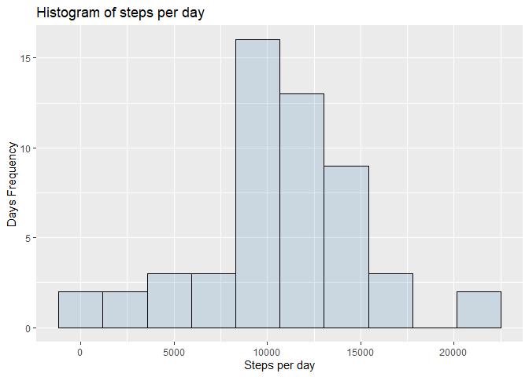
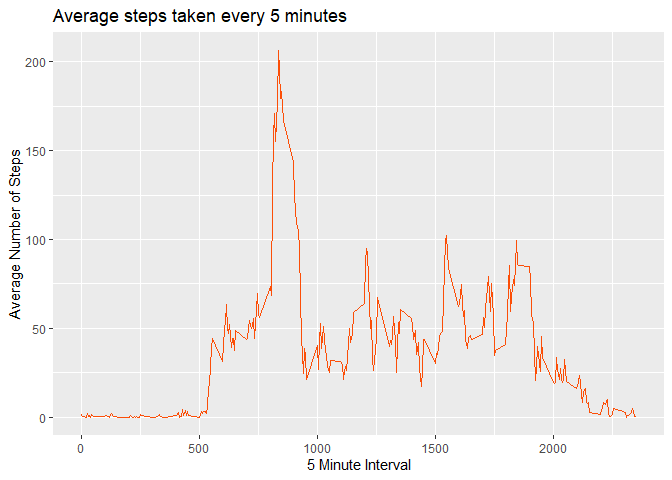

First, we load necessery packages by using the function library

```r
library(ggplot2)
library(dplyr)
library(ggthemes)
```

# Loading and preprocessing the data

## Load the activity data:
The variables included in this dataset are:

steps: Number of steps taking in a 5-minute interval (missing values are coded as NA)  
date: The date on which the measurement was taken in YYYY-MM-DD format  
interval: Identifier for the 5-minute interval in which measurement was taken  


```r
# Load the data
activity <- read.csv("activity.csv")
```


## Process/transform the data (if necessary) into a format suitable for your analysis:

Transform the data ftame to tibble

```r
activity$date <- as.Date(activity$date)
```


```r
activity <- tbl_df(activity)
```


# What is mean total number of steps taken per day?

## Calculate the total number of steps taken per day

```r
activity_day <- aggregate(steps~date,activity,sum, na.rm = TRUE)
```

## Make a histogram of the total number of steps taken each day


First compute the width of the bins to be used in the histogram by using [Freedman-Diaconis rule](https://en.wikipedia.org/wiki/Freedman%E2%80%93Diaconis_rule)


```r
bw <- 2 * IQR(activity_day$steps) / length(activity_day$steps)^(1/3)
```


Plot the Histogram

```r
ggplot(activity_day, aes(steps)) +
  geom_histogram(binwidth = bw,color="black", fill = "steelblue", alpha = 0.2) +
  labs(title="Histogram of steps per day", x="Steps per day", y="Days Frequency") 
```

<!-- -->


## Calculate and report the mean and median of the total number of steps taken per day


```r
mean_steps <- (mean(activity_day$steps))
median_steps <- (median(activity_day$steps))
```


The mean of the total number of steps taken per day: 10766.1886792453<br/>
The median of the total number of steps taken per day:10765  <br/>

# What is the average daily activity pattern?

# Make a time series plot (i.e. \color{red}{\verb|type = "l"|}type="l") of the 5-minute interval (x-axis) and the average number of steps taken, averaged across all days (y-axis)


```r
avg_activity <- aggregate(steps~interval,activity,mean,na.rm = TRUE)
```


```r
ggplot(avg_activity, aes(x = interval, y = steps)) + 
  geom_line(color = "#FC4E07") +
  labs(title="Average steps taken every 5 minutes", x="5 Minute Interval", y="Average Number of Steps") 
```

<!-- -->


## Which 5-minute interval, on average across all the days in the dataset, contains the maximum number of steps?

```r
max_ave_steps <- max(avg_activity$steps)
interval <- avg_activity %>% 
    filter(steps == max_ave_steps) %>%
    select(interval)
```

The 206.169811320755 5-minute interval, on average across all the days in the dataset, contains the maximum number of steps of 835.


# Imputing missing values


NA Count of missing data:


```r
#Check the total NA in each colums
colSums(is.na(activity))
```

```
##    steps     date interval 
##     2304        0        0
```


## If you do not understand the difference between a histogram and a barplot, research the difference between them. Make a histogram of the total number of steps taken each day
## Calculate and report the mean and median of the total number of steps taken per day


# Are there differences in activity patterns between weekdays and weekends?
